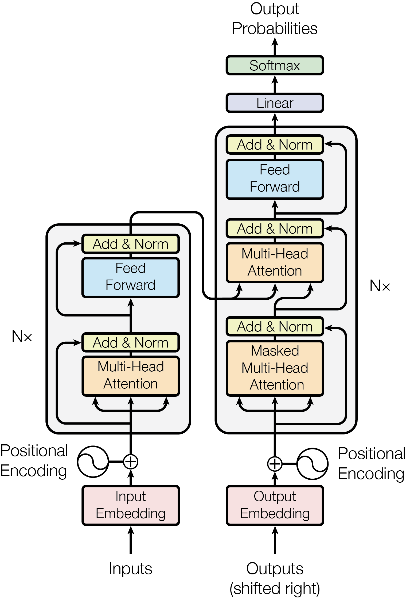
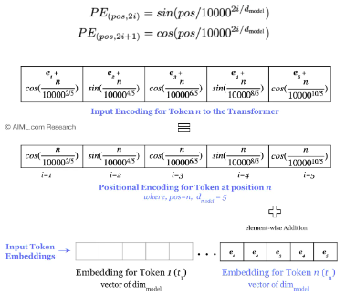

# Attention Is All You Need

It is a pytorch implementation of self-attention or transformer from scratch. In this implementation, each word is predicted rather than each character.

The image above shows the architecture of the transformer. It esssentailly consists of two blocks:
1. Encoder
2. Decoder

## Encoder Blocks:
It is used to encode all the time information into a single vector. If we look closely at the block, the encoder consists of these sections:
1. Input Encoding: The entire training and validation dataset is used to create a dictionary of words and a unique ID is assigned to each word. This was achieved by using tokenizer package from hugging face. This unique ID is then converted to to feature space of size 'd_model'. The model learns this conversion during training. This way a word say 'a' becomes:

$$
\begin{pmatrix} a_{1} \\ a_{2} \end{pmatrix}
$$

2. Positional Encoding:  'sin' and 'cos' positional encoding are added to the input encoding before starting the inference/training. This encoding is constant and not learnt and is used to make the model understand the position of each word in a sentence.

3. Self-attention: One way to understand iis that, correlation scores are calculated between the input words, i.e. how much is a word related to another word in the input. To calculate the score, following formula is used:

$$
attention(K,Q,V) = softmax (\dfrac{K @ Q^{T}}{\sqrt{d_{model}}}).V
$$

where K, Q, V represents Key, Query and Value

## Decoder Blocks:
The decoder block is very similar to the encoder block. But something to note in the decoder block is that it not only uses the encoded output consisting of information of features of previous time steps, it also uses the outputs till n-1 time steps (also called output shifted right). In the decoder, the positional encoding is applied along with the self-attention block to find the relation even among the outputs. Something extra to note here is that along with self-attention, there is also cross attention, i.e. realtion between the outputs and the inputs (self-attention is only between the inputs). And this is where the understanding of query, key and value becomes important. 

### Understanding of Attention:

For the sake of understanding, let's assume that that query, key and value are the same values, i.e. inputs converted to input embeddings and then positional encoding is added to them. Let's call it $ Z $.
Looking at the formula for attention, it becomes:

$$
attention(K,Q,V) = softmax (\dfrac{Z @ Z^{T}}{\sqrt{d_{model}}}) \cdot Z
$$

where @ means dot product 

The dot product signifies the projection of one vector over another vector:

$$
a \cdot b = |a||b| \cos \theta
$$

where $\theta$ is the angle between the two vectors.

Let's represent two words, `a` and `b` as encoded vectors:

$$
\vec{a} = \begin{bmatrix} a_1 \\ a_2 \end{bmatrix} \quad \text{and} \quad \vec{b} = \begin{bmatrix} b_1 \\ b_2 \end{bmatrix}
$$

To perform the dot product in matrix format, we will have to take the transpose of one of the vectors:

$$
\implies \vec{b} \cdot \vec{a}^{T} = \begin{bmatrix} b_1 \\ b_2 \end{bmatrix} \cdot \begin{bmatrix} a_1 & a_2 \end{bmatrix} = a_1 b_1 + a_2 b_2
$$

Thus, we know that the dot product of the words in their embedding form gives us the projection of one word over the other, i.e., how much one word is affected by another. Now let's put all the words in embedding format in one vector and perform the dot product as above:

$$
\begin{bmatrix}
a_1 & a_2 \\
b_1 & a_2
\end{bmatrix} \cdot
\begin{bmatrix}
a_1 & b_1 \\
a_2 & b_2
\end{bmatrix} =
\begin{bmatrix}
a_1 a_1 + a_2 a_2 & a_1 b_1 + a_2 b_2 \\
b_1 a_1 + a_2 b_2 & b_1 b_1 + b_2 b_2
\end{bmatrix}
$$

This way, we get the effect of each word on another word, including itself. A softmax is applied in the horizontal direction such that the effects become weighted. This way nth row represents the weight of every word on the nth word. Let's represent the attention calculates as:

$$ attention = 
\begin{bmatrix}
W_{aa} & W_{ba} \\
W_{ab} & W_{bb}
\end{bmatrix}
$$

$$
\text{where } W_{ab} \text{ means the weight of } \vec{a} \text{ on } \vec{b}
$$

Note: Sum of values along each row is 1

Then another dot product is taken between attention and $'V'$. So the result will be

$$
\begin{bmatrix}
W_{aa} & W_{ba} \\
W_{ab} & W_{bb}
\end{bmatrix}\cdot
\begin{bmatrix}
a_1 & a_2 \\
b_1 & a_2
\end{bmatrix} = 
\begin{bmatrix}
W_{aa}a_1 + W_{ba}b_1 & W_{aa}a_2 + W_{ba}b_2 \\
W_{ab}a_1 + W_{bb}b_1 & W_{ab}a_2 + W_{bb}b_2
\end{bmatrix}
$$

If looked closely, we can see that each feature of the vector is modified as per the attention calculated. For example, $a_1$ feature of vector $a$ is modified by weighted sum of feature $a_1$ and $b_1$ and so on.

### Understanding Query, Key and Value:

During implementation the embedding vector $Z$ of each vector, is multiplied by learnable weights, $W_query$, $W_key$ and $W_value$, such that the embedding vector of each word becomes Query, Key and Value. This step is important as it allows the model to learn different representations for the same input word. Query, key and Value is analogous to the following information:

1. Query ($(\vec{Q})$): Represents the word for which we are calculating attention scores.
2. Key ($(\vec{K})$): Represents the word against which the attention scores are calculated.
3. Value ($(\vec{V})$): Represents the word's contribution to the output based on the attention scores.

## Multi-headed attention:

In this implementation, we have used multi-headed attention. It enhances the model's ability to focus on different parts of the input sequence simultaneously. Instead of having a single set of query, key, and value weight matrices, multi-headed attention employs multiple sets, or "heads," each with its own set of weights. Each head performs its own attention operation, allowing the model to capture various aspects of relationships and dependencies in the data. The outputs of all heads are then concatenated and linearly transformed to produce the final attention output. This approach enables the model to aggregate diverse types of information and understand complex patterns more effectively.